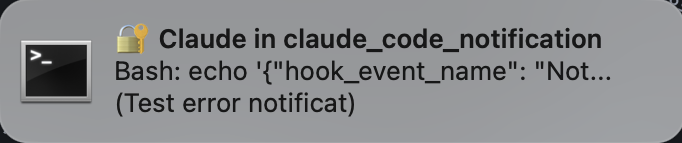

# Claude Code Notification

一个为 [Claude Code](https://claude.ai/claude-code) 添加声音和通知提醒的极简插件（macOS）。

当 Claude Code 完成任务或需要权限时，及时收到提醒。

[English](README.md)



## 功能

- **声音提醒** - 播放 macOS 系统声音
- **桌面通知** - 显示 macOS 通知（支持绕过勿扰模式）
- **一键安装** - 作为 Claude Code 插件直接从 GitHub 安装
- **可配置** - 自定义声音、开关各个事件

## 安装

### 前置条件（推荐）

```bash
brew install terminal-notifier
```

### 安装插件

在 Claude Code 中运行：

```
/plugin marketplace add digitsisyph/claude-code-notification-plugin
/plugin install claude-code-notification
```

## 卸载

```
/plugin uninstall claude-code-notification
```

## 定制化

安装后，可以编辑插件目录中的 `config.json` 来改变是否播放声音等设置：

```json
{
  "sound": true,
  "notification": true,
  "events": {
    "Stop": {
      "enabled": true,
      "sound": "Blow",
      "emoji": "✅"
    },
    "PermissionRequest": {
      "enabled": true,
      "sound": "Funk",
      "emoji": "🔐"
    },
    "Notification": {
      "enabled": true,
      "sound": "Funk",
      "emoji": "💬",
      "types": {
        "error": { "sound": "Sosumi", "emoji": "❌" },
        "warning": { "sound": "Sosumi", "emoji": "⚠️" },
        "success": { "sound": "Glass", "emoji": "✅" }
      }
    }
  }
}
```

### 配置项

| 选项 | 说明 | 默认值 |
|------|------|--------|
| `sound` | 全局声音开关 | `true` |
| `notification` | 全局通知开关 | `true` |
| `events.*.enabled` | 单个事件开关 | `true` |
| `events.*.sound` | 单个事件声音 | 见上 |
| `events.*.emoji` | 通知标题前的 emoji | 见上 |
| `events.Notification.types` | 按类型设置声音和 emoji | 可选 |

### 可用声音

`/System/Library/Sounds/` 目录下的任意 `.aiff` 文件：

`Basso`, `Blow`, `Bottle`, `Frog`, `Funk`, `Glass`, `Hero`, `Morse`, `Ping`, `Pop`, `Purr`, `Sosumi`, `Submarine`, `Tink`

## 事件说明

| 事件 | 说明 |
|------|------|
| `Stop` | Claude 完成任务 |
| `PermissionRequest` | Claude 需要你的授权 |
| `Notification` | Claude 发送的通知消息 |

## 系统要求

- macOS
- Python 3（macOS 自带）
- [terminal-notifier](https://github.com/julienXX/terminal-notifier)（推荐，可绕过勿扰模式）

## 工作原理

本插件使用 [Claude Code hooks](https://code.claude.com/docs/en/hooks) 在特定事件发生时触发 Python 脚本，播放系统声音并显示通知。

## 灵感来源

本项目受以下内容启发：

- [wyattjoh/claude-code-notification](https://github.com/wyattjoh/claude-code-notification)
- [Using terminal-notifier for Claude Code custom notifications](https://www.andreagrandi.it/posts/using-terminal-notifier-claude-code-custom-notifications/) - Andrea Grandi

## 许可证

MIT
